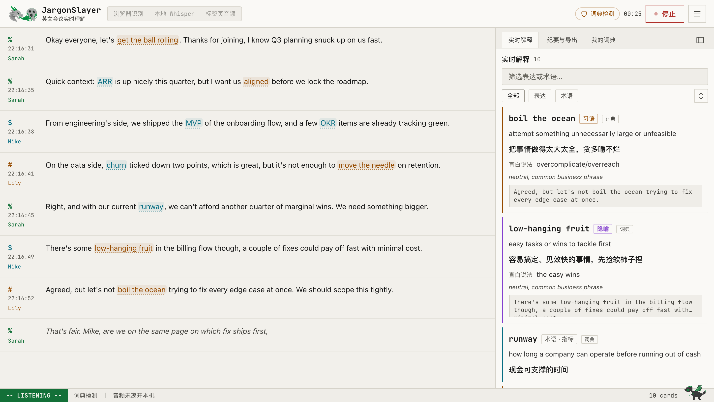
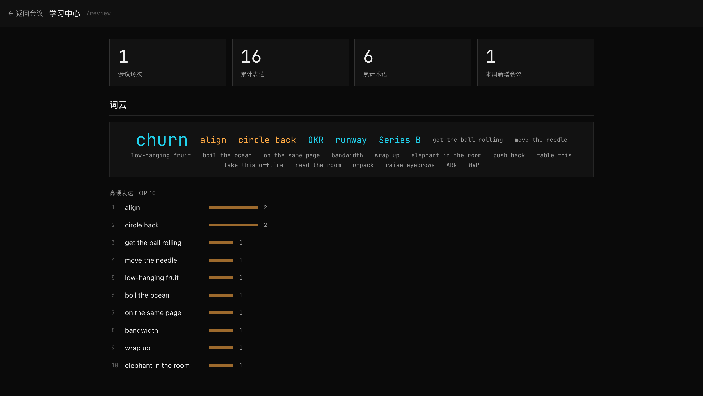

<div align="center">

<picture>
  <source media="(prefers-color-scheme: dark)" srcset="public/icon-ui-dark.png" />
  
</picture>

# JargonSlayer

**Real-time English-meeting comprehension assistant · your meeting, as a running process**

*英文会议实时理解助手 · 把会议变成一个正在运行的进程*

[](https://github.com/mianaz/jargonslayer/releases)
[](LICENSE)
[](src/lib/__tests__)
[](#privacy-boundaries-stated-explicitly)

**English** · [简体中文](README.zh-CN.md) · [**Try It Live**](https://apps.bioinfospace.com/jargonslayer) · [Website](https://mianaz.github.io/jargonslayer/)


</div>

---

It sits beside your English meetings and turns **business slang, idioms, metaphors, indirect phrasing, and jargon** into short Chinese cards in real time. When the meeting ends, one click produces a **bilingual summary, a full transcript translation, and study cards**. Data handling is **transparent by default, fully local when you choose**: every engine and every tier states exactly where audio and text go (see [Privacy boundaries](#privacy-boundaries-stated-explicitly)), and a dictionary-only, zero-API mode is always one toggle away.

> The product UI is Simplified Chinese — it is built for non-native English speakers (Chinese-speaking professionals and researchers first).

## Why

Non-native speakers rarely get stuck on vocabulary. They get stuck on:

1. **Non-literal expressions** — *move the needle*, *boil the ocean*, *table this*. You know every word; the sentence still doesn't parse, and by the time it does, the meeting has moved on.
2. **Proper nouns and acronyms** — ARR, OKR, Series B, internal codenames. A native speaker skips past them in a second; you spend that second retrieving.

JargonSlayer is the colleague sitting next to you: it never interrupts, it just tells you in the sidebar what that sentence *actually* meant.

## Features

- **Real-time transcription** — browser speech recognition (cloud), local Whisper, or tab audio (the latter two never leave the machine). Every engine is labeled **local / cloud** so the data path is visible at a glance; a zero-dependency demo shows the whole flow without a microphone or key. Browser recognition is supervised by a voice-activity detector: session rotations land in real pauses, recovery never discards buffered speech, and a persistent language mismatch gets a one-time hint instead of silent text loss.
- **Real-time expression detection** — an LLM uses surrounding context to explain only what "literal ≠ actual" (it can tell whether *table this* means shelving a topic or furniture); proper nouns get separate term cards. A built-in dictionary (430+ entries, 11 topic packs from business to academia to pharma/biotech, community packs installable from GitHub) is the always-on instant layer — hits render immediately and the AI upgrades them in place; with AI off it works fully offline. Explanations can be Chinese or English.
- **Bilingual live transcript** (optional) — turn it on in Settings and every finalized segment gets a Chinese translation line under the English text as the meeting happens, not just in the post-meeting report.
- **Card experience** — expression and term cards share one block style with category-colored status bars; repeats increment a counter instead of flooding the feed; underlined expressions in the transcript jump to their card; select any text for an ad-hoc lookup and one-click save to your glossary.
- **Speakers** — import a recording for offline transcription + speaker diarization (background job, auto-loads when done), or turn on realtime diarization (beta, local, labels refine as the meeting proceeds). Click a speaker label to rename it.
- **Import a transcript** — already have the text? Paste it or upload a `.txt` / `.srt` / `.vtt` export (Zoom, Otter, …) and get the full experience on it: speakers and timestamps parsed when present, jargon detection cards, optional Chinese translation lines, saved straight to history as an editable stopped session.
- **Import an audio or video file, transcribed entirely in-browser** — upload a `.wav` / `.mp3` / `.m4a` / `.flac` recording (or an `.mp4` / `.webm` / `.mov` / `.mkv` / `.m4v` video — the audio track is auto-extracted via ffmpeg.wasm first) and Whisper runs locally in a Web Worker (WebGPU when available, WASM otherwise); nothing uploads anywhere, works out of the box on the hosted demo, and the transcript flows into the same detection/translation pipeline as every other import.
- **Import from a video URL** (local Whisper sidecar only) — paste a link and the sidecar's `yt-dlp` downloads + transcribes it through the same job pipeline as an uploaded recording; **local-tier only, not on the hosted demo** — a datacenter fetching third-party video is both a platform-terms and (per *Cordova v. Huneault*, 2026) a DMCA §1201 problem the moment it's server-side, so this runs on your machine, under your account, at your own risk.
- **One import hub + background task center** — a single 导入 entrance (files / pasted transcripts / URLs) — right in the header, beside the live engine modes, and from History — with a task tray in the status bar: progress survives closing the drawer, finished tasks jump to their session, and task lifecycle events (`task.started/done/error`) POST to your webhook.
- **Post-meeting artifacts** — bilingual summary (topic / key points / decisions / action items), paragraph-aligned translation, study cards, and a **Cornell-note sheet** (highlighted body + margin annotations, exportable as PNG or Markdown); plus Markdown / Anki TSV / JSON export, auto-save to a folder, and a webhook.
- **Learning loop** — mark a card 太简单/别再提示 and that term stops surfacing in live detection (two-tap protection + undo, and a 90-day refresher so a mis-marked term can't silently disappear forever); `/review` adds a due-driven spaced-repetition mode (不认识/模糊/认识 three-grade SM-2-lite scheduling, streaks, daily due counts) alongside free browsing, plus a 已知词 list to un-suppress; your personal glossary auto-enrolls and still feeds detection in later meetings.
- **BYOK, multi-model** — Anthropic direct or any OpenAI-compatible endpoint (DeepSeek / Qwen / OpenRouter / Ollama); or connect an OpenRouter account in one click. The key lives in your local browser and is relayed in memory (never persisted) through this app's own API routes when it calls out — or skip the browser entirely with an env var.
- **Simple/advanced settings** — new users see three sections (engine, AI detection, display); the 高级 toggle reveals BYOK, per-task models, diarization, data & integrations. Anyone with an advanced setting already configured is auto-promoted so nothing they rely on is hidden.
- **Background profile (opt-in)** — tell the AI your industry/role/English level and detection explanations calibrate to you; sent only as a capped hint line with requests, off by default, prompt-cache-safe.
- **Diagnostics you can actually send** — error toasts carry a short ref like `[JS-K3F9]` plus a 复制诊断 action; advanced settings → 数据与联动 has a full 诊断信息 panel with its own 复制诊断信息 button, copying a secrets-stripped report for filing issues.
- **Themes, light and dark** — seven built-in themes on a strict 17-token engine: the terminal dark default, a light "paper" counterpart, a high-contrast dark variant, plus 水墨 (ink-wash light), 魔典 (gothic grimoire), 黑金 (noir), and 青绿 (mineral-pigment landscape). Every theme (including light) is contrast-checked against WCAG AA in the test suite; native controls, scrollbars, and the app icon follow the active scheme. Plus global and transcript-only font-size controls.
- **History without accounts** — everything in IndexedDB; search old meetings by expression; export a full backup (sessions, glossary, and your learn-set) / import to restore, from Settings.

<div align="center">
<table>
  <tr>
    <td></td>
    <td></td>
  </tr>
  <tr>
    <td align="center"><sub>the REPL at rest</sub></td>
    <td align="center"><sub>minutes &amp; export</sub></td>
  </tr>
  <tr>
    <td></td>
    <td></td>
  </tr>
  <tr>
    <td align="center"><sub>the same meeting, light theme</sub></td>
    <td align="center"><sub>learning center</sub></td>
  </tr>
</table>
</div>

## Local setup

*(Section also in [简体中文](README.zh-CN.md#本地安装与运行).)*

Two independent pieces: **the app** (a Next.js server — required) and **the local Whisper sidecar** (a Python process — optional, only needed for audio that never leaves the machine). Set up the app first; add the sidecar whenever you want local mic/tab transcription.

### Prerequisites

- **git** — check with `git --version`; install from [git-scm.com](https://git-scm.com/downloads) if missing
- **Node.js ≥ 20** (this repo's own dev environment runs 24) — check with `node -v`; get it from [nodejs.org](https://nodejs.org/) or a version manager (nvm, fnm, …)
- **Python ≥ 3.9** — only needed for Step 2 below; check with `python3 --version`; get it from [python.org](https://www.python.org/downloads/) if missing

### Step 1 — the app

```bash
git clone https://github.com/mianaz/jargonslayer.git
cd jargonslayer
npm ci
npm run build && npm start
# while developing instead: npm run dev
# open http://localhost:3000
```

`npm ci` installs exactly what the committed lockfile pins. The project became an npm workspace at v0.4 (root + `apps/web` + `packages/core`) — the commands above didn't change, but if you're updating an old clone from before that, run `npm ci` again after pulling to pick up the new workspace layout.

> Never set `NEXT_PUBLIC_DEPLOY_TIER` for a local run — that variable exists only for the hosted preview build (it swaps in a shared demo key and a trimmed model list). Leave it unset and you get the full local build.

On first launch an onboarding tour appears. **Open the ≡ menu (top right) and click 「演示」 (Demo) first** — no microphone, no API key, and you'll see the full transcription → detection → cards → report flow (the demo runs on the built-in dictionary when no key is configured). The dictionary needs nothing else — it detects instantly, offline. AI detection and post-meeting reports need a key; see [Configure an API key](#configure-an-api-key-unlocks-ai-detection-and-reports) below.

### Step 2 — the local Whisper sidecar (optional but recommended)

This is what unlocks the 本地 Whisper mic engine, 标签页音频 (tab/stream capture — hearing the other side of an online meeting), and the sidecar-backed route for file and URL imports (better quality plus diarization on uploads; the only route for URL/`yt-dlp` imports). Every one of those keeps audio on this machine.

```bash
cd sidecar
python3 -m venv .venv && source .venv/bin/activate
pip install -r requirements.txt
python whisper_server.py --model medium
```

Wait for the banner. The first run downloads the model from Hugging Face; the port only opens once that download *and* the model load finish. Depending on the model size and your connection this can take a while before anything prints — that's normal, not a hang. You'll see something like:

```
============================================================
JargonSlayer 本地 Whisper 服务 / local Whisper sidecar
  model:     medium
  device:    cpu
  load:      12.34s
  diarize:   off
ws://127.0.0.1:8765 等待连接 — 在 JargonSlayer 设置中选择「本地 Whisper」
http://127.0.0.1:8766 录音上传任务 API — PUT /transcribe, POST /ingest-url, GET /jobs
============================================================
```

Once that `ws://... 等待连接` line shows up, go back to the page: Settings → transcription engine → 本地 Whisper → 开始监听.

Gray interim text while someone is speaking (the typing effect) is now app-controlled, on by default: Settings → transcription/engine → 「实时转录预览」 — toggle it per session without restarting the sidecar. The sidecar's own `--partials` flag still exists, but only as a server-side default for an old app build that never sends the setting.

| Model | Quality | Speed | Best for |
|---|---|---|---|
| `tiny` / `base` | Basic | Very fast | Low-spec machines, quick test only |
| `small` (sidecar default) | Good | Realtime with headroom | Lightweight, fine for clean mostly-English audio |
| `medium` | Better | Near realtime | **Recommended — best balance for live 中英夹杂 (code-switched zh-en)** |
| `large-v3` | Best | Too slow live on Apple Silicon CPU | Best accuracy — batch/upload re-transcription on Mac, or live if you have an NVIDIA GPU |

Rule of thumb: Apple Silicon doing a live meeting → `medium`. Have an NVIDIA GPU → `large-v3` live is fine too. Old or no-GPU laptop → `small`. None of these switch languages mid-sentence flawlessly — Whisper picks one language per ~30-second window; the jargon detection and Chinese gloss layer on top is what actually carries the bilingual experience, not the transcription itself.

**Picking an engine**: mic only → 本地 Whisper. Need the other side of an online meeting, or any browser tab/stream → 标签页音频 (same sidecar, still fully local). Don't want to install anything → 浏览器识别, the zero-setup fallback — but plainly: that sends your audio to Chrome's speech service (Google).

### Troubleshooting

- **`无法连接本地 Whisper` toast** — the sidecar isn't running, or it's still downloading/loading the model (wait for the banner above). Check with `nc -z localhost 8765 && echo UP || echo DOWN`.
- **`pip install -r requirements.txt` fails on `claude-agent-sdk`** — that dependency needs Python ≥ 3.10 and is only for the separate, optional [subscription-direct](#subscription-direct-experimental-local-dev-build-only) agent sidecar, not transcription. Install just the three transcription deps instead: `pip install "faster-whisper>=1.0,<2.0" "websockets>=12,<14" "numpy>=1.24,<3.0"`.
- **`npm start` errors** with "Could not find a production build in the '.next' directory" — run `npm run build` first; `start` only serves an existing build.
- **Port already in use** — pass `--port <n>` to `whisper_server.py`, then update it to match in Settings → transcription engine → Whisper 地址.

> **Desktop app**: an early dev build already exists — see [Desktop build (in development)](#desktop-build-in-development) right below. A signed installer (no `npm`/terminal at all) ships later in v0.4 (S8).

### Desktop build (in development)

A native desktop shell (Tauri) wraps this same app with a self-managed local Whisper sidecar — no `pip`/terminal commands for Step 2 above. Still under active development (v0.4 S3) — this is the developer path, not a signed installer yet.

```bash
npm ci
npm run dev:desktop
```

On first launch a full-screen wizard asks for consent (nothing downloads until you click 「开始安装」), then installs an isolated Python runtime + faster-whisper + a small Whisper model entirely under the app's own data directory — never touches your system Python, and deleting that directory is a clean uninstall:

- macOS: `~/Library/Application Support/com.bioinfospace.jargonslayer/` (Python/venv, model cache, provision marker) and `~/Library/Logs/com.bioinfospace.jargonslayer/whisper_server.log`

Settings → transcription engine gets a 托管模式 (sidecar mode) toggle on this build: **managed** (default — the app installs/starts/auto-restarts the sidecar itself; Whisper 地址 is fixed) or **external** — point it at a sidecar you started yourself with Step 2 above instead, exactly like the regular web build.

## Configure an API key (unlocks AI detection and reports)

The built-in dictionary only matches fixed phrases. An Anthropic API key adds context-aware detection plus post-meeting summaries and translation. Two ways:

1. **In the UI**: ≡ menu → 「设置」 (Settings) → switch the top toggle to 「高级」 (Advanced) → AI 检测 → API Key. Stored in your local browser (IndexedDB); each call is relayed once, in memory, through this app's own `/api/*` routes before reaching the model provider — never written to disk or logged, but it does pass through that server's memory, which is not the same claim as "never touches a server." If you're self-hosting, that server is your own machine.
2. **Environment variable** (recommended — the hardened, zero-browser-storage posture): the key never enters the browser at all, it only ever lives in the server process. Create `.env.local` in the project root:
   ```
   ANTHROPIC_API_KEY=sk-ant-...
   ```
   then restart `npm run dev`.

Get a key at [console.anthropic.com](https://console.anthropic.com/). Defaults: `claude-haiku-4-5` for realtime detection (fast, cheap), `claude-sonnet-5` for reports (quality) — both configurable in Settings.

**Cost reference**: a 60-minute, ~9000-word meeting ≈ $0.5 of realtime detection + $0.3–0.55 of reports, roughly **$1/meeting**; dictionary-only mode is $0.

## Transcription engines

| | Setup cost | Audio destination | Best for |
|---|---|---|---|
| Browser recognition | None | Browser vendor's speech service (**cloud**) | Everyday non-sensitive meetings (Chrome/Edge) |
| Local Whisper | One-time Python setup | **Never leaves the machine** | Sensitive content, offline, steadier accuracy |
| Tab audio | Same sidecar as above | **Never leaves the machine** | Hearing the *other side* of an online meeting, no virtual sound card |

「演示」 (Demo) is not an engine — it's a menu entry that replays a scripted meeting so you can see everything with zero setup.

### Local Whisper (privacy mode)

Setup, the "ready" banner, model choice, and troubleshooting all live in [Local setup → Step 2](#step-2--the-local-whisper-sidecar-optional-but-recommended).

Useful flags once it's running: `--language en` (default), `--save-audio meeting.wav` (keep audio for post-meeting diarization). `--partials` (gray interim text while speaking, more CPU) is now controlled per session by the app's own 「实时转录预览」 setting (on by default) — the flag only matters as this sidecar's default for an old app build that never sends that setting.

### ⚠️ Hearing "the other side" (must-read for online meetings)

Your microphone only hears **you**. In Zoom/Teams/Meet the other side comes out of your speakers, so system audio has to become an input device:

- **macOS**: install [BlackHole](https://github.com/ExistentialAudio/BlackHole) (free virtual device) → create a Multi-Output Device (headphones + BlackHole, so you still hear normally) → set JargonSlayer's microphone to BlackHole and use the **local Whisper** engine (browser recognition ignores virtual device selection).
- **Windows**: VB-Cable, same idea.
- To capture you *and* them: an Aggregate Device (mic + BlackHole) on macOS.

## Usage flow

1. Pick an engine → 「开始监听」 (Start listening); the browser asks for microphone permission.
2. Transcript flows on the left; 「实时解释」 cards appear on the right. Underlined expressions are clickable; selecting any span pops an ad-hoc explanation.
3. 「停止」 (Stop) → the session auto-saves → 「纪要与导出」 (Summary & export) → 「生成会议报告」 (Generate report).
4. Export Markdown / Anki TSV (imports straight into Anki: File → Import, tab-separated) / JSON.
5. ≡ menu → 「历史」 (History) reopens any past meeting — searchable by expression ("which meeting said *boil the ocean*?").

## Speaker diarization (optional)

Both paths are built into the UI. One-time shared setup:

1. `pip install pyannote.audio` inside the sidecar's `.venv`;
2. Free HuggingFace account → accept the terms of **all three** models: [segmentation-3.0](https://huggingface.co/pyannote/segmentation-3.0), [speaker-diarization-3.1](https://huggingface.co/pyannote/speaker-diarization-3.1), [speaker-diarization-community-1](https://huggingface.co/pyannote/speaker-diarization-community-1) (new dependency in pyannote 4.x — skipping it causes a 403);
3. Create a Read-scoped token and paste it into Settings → 说话人分离 (or pass `--hf-token` when starting the sidecar).

**Import a recording**: ≡ menu → 「历史」 → 「导入」 → 「文件」 tab, pick an m4a/mp3/wav; it transcribes + diarizes in the background and auto-loads when done. Click a speaker chip to rename (SPEAKER_1 → Elena).

**Realtime diarization (beta)**: Settings → 说话人分离 → 「实时说话人分离（beta）」. Labels appear a few seconds late and refine as the meeting proceeds; extra CPU, transcription unaffected.

> Note: the sidecar `.venv` contains absolute paths — after moving/renaming the project directory, rebuild it (`rm -rf .venv && python3 -m venv .venv && pip install -r requirements.txt`).

## Subscription-direct (experimental, local dev build only)

**This is NOT "we connect your subscription for you" — it's your own local JargonSlayer asking the `claude`/`codex` CLI you're ALREADY logged into on this machine to answer one question.** Exactly what running `claude -p '...'` / `codex exec '...'` yourself would do, just with a local process typing the command for you. Credentials always stay in your own `claude`/`codex` login state — this project never reads, never persists a copy, and never routes it through any server (including the hosted demo's Vercel backend). Only **detect** (live detection) and **define** (on-demand explanation) use this path; translate/summarize always use the existing route, unchanged. Subject to change under Anthropic/OpenAI's third-party developer policy at any time — three independent kill switches (local toggle / build flag / remote kill) let you (or the maintainer) turn it off instantly.

One-time setup:

1. In a terminal, run `claude` (or `claude setup-token`) to complete Claude subscription login, or `codex login` for ChatGPT — JargonSlayer never provides a login button, only detects whether you're logged in and tells you which command to run yourself;
2. `cd sidecar && pip install -r requirements.txt` (adds `claude-agent-sdk`, installed into the sidecar's `.venv`);
3. Start this agent sidecar on its own (a separate process from the whisper transcription sidecar — neither depends on the other):

```bash
cd sidecar
python -m sidecar.agent_server --port 8767
# the startup banner prints a one-time "connection code", e.g.:
#   连接码（复制到 设置 → 订阅直连（实验性）→ 连接码）：xxxxxxxx
```

4. In the web app: Settings → 「订阅直连（实验性）」 → check enable → pick a Provider (Claude / ChatGPT) → paste the connection code from step 3.

The Settings section shows host status and each provider's own login status; on quota exhaustion or a missing login it automatically falls back to the built-in offline dictionary with a one-time toast — it never silently switches to your configured BYOK key instead.

> Requires `NEXT_PUBLIC_ENABLE_SUBSCRIPTION_DIRECT=1` at build time — unset, this section's UI and call code are entirely absent from the build (the hosted demo's build never sets it, so it never appears there).

## Versions

The same product ships in tiers that differ in **form factor, not payment** — everything is free and open source:

| Capability | Chrome extension (Lite, planned) | Preview ([hosted](https://apps.bioinfospace.com/jargonslayer)) | Local / Desktop |
|---|---|---|---|
| Dictionary detection (instant, offline) | ✓ | ✓ | ✓ |
| Transcription | Web Speech | Web Speech | Web Speech · local Whisper · tab audio |
| AI detection / translation / summary | — | ✓ built-in demo key (rate-limited, fixed model list) | ✓ your own key (BYOK) |
| Import text / audio / video (in-browser) | — | ✓ | ✓ |
| Import from URL (yt-dlp) | — | shown, needs local sidecar | ✓ |
| Speaker diarization | — | shown, needs local sidecar | ✓ |
| BYOK / OAuth connect | — | shown, disabled | ✓ |

In the preview, features that need the local sidecar or your own credentials are visible but greyed with a 「本地版功能」 badge — what you see is the full product, not a cut-down one.

## Privacy boundaries (stated explicitly)

**Positioning: transparent by default, fully local when you choose.** Each tier's data paths:

| Data | Destination |
|---|---|
| Audio (local Whisper / tab audio) | Local only, websocket on 127.0.0.1 |
| Audio (browser recognition / Web Speech) | Browser vendor's speech service (e.g. Google) — in **every** tier that uses Web Speech, including the extension |
| Audio/video file imports | Local only — transcribed in-browser (Whisper via WebGPU/WASM, ffmpeg.wasm), never uploaded |
| Transcript text (preview tier, AI on) | Transits our server **in memory only** (never stored) → forwarded to OpenRouter **with `provider.data_collection="allow"`** (required for the demo key's model routing — treat preview text as shareable with model providers) |
| Transcript text (local tier, BYOK AI on) | Directly to the endpoint **you** configure; the `data_collection` flag is **not** set — your provider's own privacy terms apply |
| Transcript text (subscription-direct on, detect/define only) | Your own machine's `claude`/`codex` CLI, never through any server |
| Transcript text (AI off / dictionary mode) | Local only |
| History, settings, API key | Local browser only (IndexedDB / localStorage) |

To keep all text on the machine: Settings → turn off 「AI 检测」 (the built-in dictionary keeps detecting instantly, fully offline). The vim-style status line always shows the current audio path (「音频未离开本机」 / 「音频经浏览器厂商云端识别」).

## Meet Bit 🐉


The pixel dragon perched on the status line is **Bit** — cursor-block pupils that blink like a caret, dorsal fins that light up like a signal meter while listening, and ANSI-colored pixel fire when a new card lands. It sleeps 30 seconds after a meeting ends.

It is also interactive. Try clicking it. Try clicking it three times fast. Try holding it down.

<br clear="right" />

## FAQ

- **"浏览器不支持语音识别" (speech recognition unsupported)** — Safari/Firefox have weak Web Speech support; use Chrome/Edge or switch to local Whisper.
- **Whisper won't connect** — confirm the sidecar terminal is open and the address is `ws://localhost:8765`; check the local firewall.
- **Too few / too many cards** — adjust 「置信度阈值」 (confidence threshold) in Settings, or switch detection models.
- **Detection slows when the tab is backgrounded** — browsers throttle background timers; switching back triggers an immediate catch-up. Mitigated with event-driven flushing.
- **Report generation is slow** — long-meeting translation runs in parallel chunks; 1–2 minutes is normal. Cards can be exported without generating a report.

## Architecture

Next.js 15 (App Router) + TypeScript + Tailwind + zustand + IndexedDB; LLM calls go through server-side route proxies (Anthropic Messages API or OpenAI-compatible, structured output with repair-retry); local transcription is a faster-whisper sidecar over websocket with energy-based VAD; diarization via pyannote 4.x.

## License

[MIT](LICENSE) © 2026 Miana Zeng
