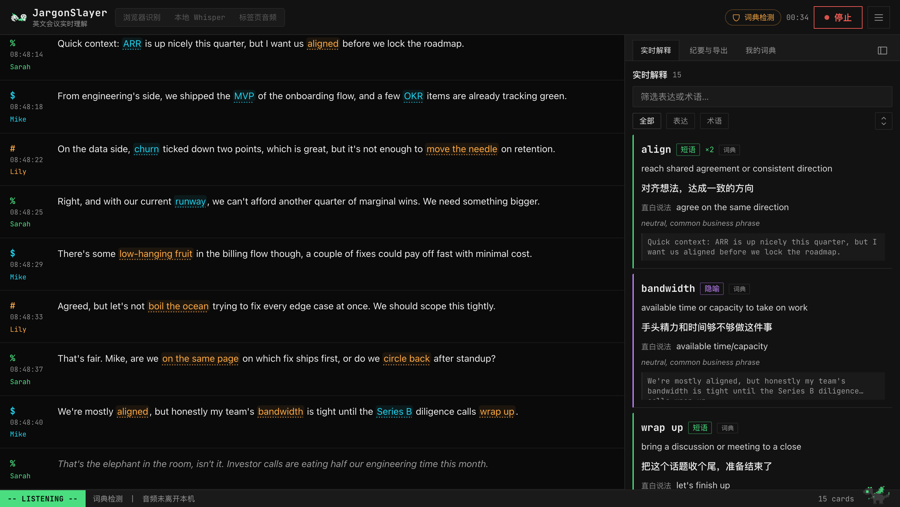
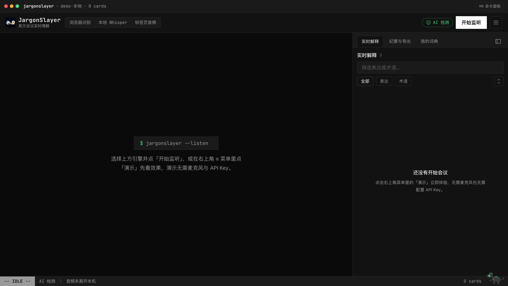
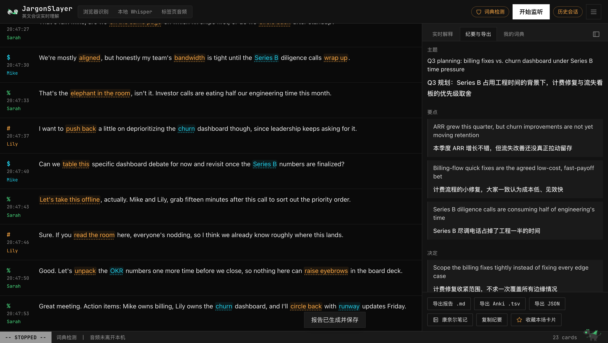

<div align="center">


# JargonSlayer

**Real-time English-meeting comprehension assistant · your meeting, as a running process**

*英文会议实时理解助手 · 把会议变成一个正在运行的进程*

[](https://github.com/mianaz/jargonslayer/releases)
[](LICENSE)
[](src/lib/__tests__)
[](#privacy-boundaries-stated-explicitly)

**English** · [简体中文](README.zh-CN.md) · [**Try It Live**](https://apps.bioinfospace.com/jargonslayer) · [Website](https://mianaz.github.io/jargonslayer/)



</div>

---

It sits beside your English meetings and turns **business slang, idioms, metaphors, indirect phrasing, and jargon** into short Chinese cards in real time. When the meeting ends, one click produces a **bilingual summary, a full transcript translation, and study cards**. Everything stays on your machine.

> The product UI is Simplified Chinese — it is built for non-native English speakers (Chinese-speaking professionals and researchers first).

## Why

Non-native speakers rarely get stuck on vocabulary. They get stuck on:

1. **Non-literal expressions** — *move the needle*, *boil the ocean*, *table this*. You know every word; the sentence still doesn't parse, and by the time it does, the meeting has moved on.
2. **Proper nouns and acronyms** — ARR, OKR, Series B, internal codenames. A native speaker skips past them in a second; you spend that second retrieving.

JargonSlayer is the colleague sitting next to you: it never interrupts, it just tells you in the sidebar what that sentence *actually* meant.

## Features

- **Real-time transcription** — browser speech recognition (cloud), local Whisper, or tab audio (the latter two never leave the machine). Every engine is labeled **local / cloud** so the data path is visible at a glance; a zero-dependency demo shows the whole flow without a microphone or key.
- **Real-time expression detection** — an LLM uses surrounding context to explain only what "literal ≠ actual" (it can tell whether *table this* means shelving a topic or furniture); proper nouns get separate term cards. Without an API key it falls back to a built-in dictionary (370+ entries, 10 topic packs from business to academia) and can install community packs from GitHub. Explanations can be Chinese or English.
- **Bilingual live transcript** (optional) — turn it on in Settings and every finalized segment gets a Chinese translation line under the English text as the meeting happens, not just in the post-meeting report.
- **Card experience** — expression and term cards share one block style with category-colored status bars; repeats increment a counter instead of flooding the feed; underlined expressions in the transcript jump to their card; select any text for an ad-hoc lookup and one-click save to your glossary.
- **Speakers** — import a recording for offline transcription + speaker diarization (background job, auto-loads when done), or turn on realtime diarization (beta, local, labels refine as the meeting proceeds). Click a speaker label to rename it.
- **Import a transcript** — already have the text? Paste it or upload a `.txt` / `.srt` / `.vtt` export (Zoom, Otter, …) and get the full experience on it: speakers and timestamps parsed when present, jargon detection cards, optional Chinese translation lines, saved straight to history as an editable stopped session.
- **Import an audio or video file, transcribed entirely in-browser** — upload a `.wav` / `.mp3` / `.m4a` / `.flac` recording (or an `.mp4` / `.webm` / `.mov` / `.mkv` / `.m4v` video — the audio track is auto-extracted via ffmpeg.wasm first) and Whisper runs locally in a Web Worker (WebGPU when available, WASM otherwise); nothing uploads anywhere, works out of the box on the hosted demo, and the transcript flows into the same detection/translation pipeline as every other import.
- **Import from a video URL** (local Whisper sidecar only) — paste a link and the sidecar's `yt-dlp` downloads + transcribes it through the same job pipeline as an uploaded recording; **local-tier only, not on the hosted demo** — a datacenter fetching third-party video is both a platform-terms and (per *Cordova v. Huneault*, 2026) a DMCA §1201 problem the moment it's server-side, so this runs on your machine, under your account, at your own risk.
- **Post-meeting artifacts** — bilingual summary (topic / key points / decisions / action items), paragraph-aligned translation, study cards, and a **Cornell-note sheet** (highlighted body + margin annotations, exportable as PNG or Markdown); plus Markdown / Anki TSV / JSON export, auto-save to a folder, and a webhook.
- **Learning center** — `/review` has stats, a frequency Top 10, a word cloud, and a flashcard practice deck; your personal glossary feeds back into detection in later meetings.
- **BYOK, multi-model** — Anthropic direct or any OpenAI-compatible endpoint (DeepSeek / Qwen / OpenRouter / Ollama); or connect an OpenRouter account in one click. The key lives only in your local browser.
- **History without accounts** — everything in IndexedDB; search old meetings by expression; one-click full backup and restore.

<div align="center">
<table>
  <tr>
    <td></td>
    <td></td>
  </tr>
  <tr>
    <td align="center"><sub>the REPL at rest</sub></td>
    <td align="center"><sub>minutes &amp; export</sub></td>
  </tr>
</table>
</div>

## Quickstart

```bash
git clone https://github.com/mianaz/jargonslayer.git
cd jargonslayer
npm install
npm run dev
# open http://localhost:3000
```

On first launch an onboarding tour appears. **Open the ≡ menu (top right) and click 「演示」 (Demo) first** — no microphone, no API key, and you'll see the full transcription → detection → cards → report flow (the demo runs on the built-in dictionary when no key is configured).

## Configure an API key (unlocks AI detection and reports)

The built-in dictionary only matches fixed phrases. An Anthropic API key adds context-aware detection plus post-meeting summaries and translation. Two ways:

1. **In the UI** (recommended): ≡ menu → 「设置」 (Settings) → AI 检测 → API Key. Stored only in your local browser, sent directly with each request.
2. **Environment variable**: create `.env.local` in the project root:
   ```
   ANTHROPIC_API_KEY=sk-ant-...
   ```
   then restart `npm run dev`.

Get a key at [console.anthropic.com](https://console.anthropic.com/). Defaults: `claude-haiku-4-5` for realtime detection (fast, cheap), `claude-sonnet-5` for reports (quality) — both configurable in Settings.

**Cost reference**: a 60-minute, ~9000-word meeting ≈ $0.5 of realtime detection + $0.3–0.55 of reports, roughly **$1/meeting**; dictionary-only mode is $0.

## Transcription engines

| | Setup cost | Audio destination | Best for |
|---|---|---|---|
| Browser recognition | None | Browser vendor's speech service (**cloud**) | Everyday non-sensitive meetings (Chrome/Edge) |
| Local Whisper | One-time Python setup | **Never leaves the machine** | Sensitive content, offline, steadier accuracy |
| Tab audio | Same sidecar as above | **Never leaves the machine** | Hearing the *other side* of an online meeting, no virtual sound card |

「演示」 (Demo) is not an engine — it's a menu entry that replays a scripted meeting so you can see everything with zero setup.

### Local Whisper (privacy mode)

```bash
cd sidecar
python3 -m venv .venv && source .venv/bin/activate
pip install -r requirements.txt
python whisper_server.py --model small
# when you see "ws://127.0.0.1:8765 等待连接" (waiting for connection),
# go back to the page: Settings → transcription engine → 本地 Whisper → 开始监听
```

| Model | Quality | Speed | Best for |
|---|---|---|---|
| `tiny` / `base` | Basic | Very fast | Low-spec machines |
| `small` (default) | Good | Realtime with headroom | **Daily use** |
| `medium` | Better | Near realtime | Heavy accents, technical vocabulary |
| `large-v3` | Best | Slower | Post-meeting re-transcription |

Useful flags: `--language en` (default), `--partials` (gray interim text while speaking, more CPU), `--save-audio meeting.wav` (keep audio for post-meeting diarization).

### ⚠️ Hearing "the other side" (must-read for online meetings)

Your microphone only hears **you**. In Zoom/Teams/Meet the other side comes out of your speakers, so system audio has to become an input device:

- **macOS**: install [BlackHole](https://github.com/ExistentialAudio/BlackHole) (free virtual device) → create a Multi-Output Device (headphones + BlackHole, so you still hear normally) → set JargonSlayer's microphone to BlackHole and use the **local Whisper** engine (browser recognition ignores virtual device selection).
- **Windows**: VB-Cable, same idea.
- To capture you *and* them: an Aggregate Device (mic + BlackHole) on macOS.

## Usage flow

1. Pick an engine → 「开始监听」 (Start listening); the browser asks for microphone permission.
2. Transcript flows on the left; 「实时解释」 cards appear on the right. Underlined expressions are clickable; selecting any span pops an ad-hoc explanation.
3. 「停止」 (Stop) → the session auto-saves → 「纪要与导出」 (Summary & export) → 「生成会议报告」 (Generate report).
4. Export Markdown / Anki TSV (imports straight into Anki: File → Import, tab-separated) / JSON.
5. ≡ menu → 「历史」 (History) reopens any past meeting — searchable by expression ("which meeting said *boil the ocean*?").

## Speaker diarization (optional)

Both paths are built into the UI. One-time shared setup:

1. `pip install pyannote.audio` inside the sidecar's `.venv`;
2. Free HuggingFace account → accept the terms of **all three** models: [segmentation-3.0](https://huggingface.co/pyannote/segmentation-3.0), [speaker-diarization-3.1](https://huggingface.co/pyannote/speaker-diarization-3.1), [speaker-diarization-community-1](https://huggingface.co/pyannote/speaker-diarization-community-1) (new dependency in pyannote 4.x — skipping it causes a 403);
3. Create a Read-scoped token and paste it into Settings → 说话人分离 (or pass `--hf-token` when starting the sidecar).

**Import a recording**: ≡ menu → 「历史」 → 「导入录音」, pick an m4a/mp3/wav; it transcribes + diarizes in the background and auto-loads when done. Click a speaker chip to rename (SPEAKER_1 → Elena).

**Realtime diarization (beta)**: Settings → 说话人分离 → 「实时说话人分离（beta）」. Labels appear a few seconds late and refine as the meeting proceeds; extra CPU, transcription unaffected.

> Note: the sidecar `.venv` contains absolute paths — after moving/renaming the project directory, rebuild it (`rm -rf .venv && python3 -m venv .venv && pip install -r requirements.txt`).

## Subscription-direct (experimental, local dev build only)

**This is NOT "we connect your subscription for you" — it's your own local JargonSlayer asking the `claude`/`codex` CLI you're ALREADY logged into on this machine to answer one question.** Exactly what running `claude -p '...'` / `codex exec '...'` yourself would do, just with a local process typing the command for you. Credentials always stay in your own `claude`/`codex` login state — this project never reads, never persists a copy, and never routes it through any server (including the hosted demo's Vercel backend). Only **detect** (live detection) and **define** (on-demand explanation) use this path; translate/summarize always use the existing route, unchanged. Subject to change under Anthropic/OpenAI's third-party developer policy at any time — three independent kill switches (local toggle / build flag / remote kill) let you (or the maintainer) turn it off instantly.

One-time setup:

1. In a terminal, run `claude` (or `claude setup-token`) to complete Claude subscription login, or `codex login` for ChatGPT — JargonSlayer never provides a login button, only detects whether you're logged in and tells you which command to run yourself;
2. `cd sidecar && pip install -r requirements.txt` (adds `claude-agent-sdk`, installed into the sidecar's `.venv`);
3. Start this agent sidecar on its own (a separate process from the whisper transcription sidecar — neither depends on the other):

```bash
cd sidecar
python -m sidecar.agent_server --port 8767
# the startup banner prints a one-time "connection code", e.g.:
#   连接码（复制到 设置 → 订阅直连（实验性）→ 连接码）：xxxxxxxx
```

4. In the web app: Settings → 「订阅直连（实验性）」 → check enable → pick a Provider (Claude / ChatGPT) → paste the connection code from step 3.

The Settings section shows host status and each provider's own login status; on quota exhaustion or a missing login it automatically falls back to the built-in offline dictionary with a one-time toast — it never silently switches to your configured BYOK key instead.

> Requires `NEXT_PUBLIC_ENABLE_SUBSCRIPTION_DIRECT=1` at build time — unset, this section's UI and call code are entirely absent from the build (the hosted demo's build never sets it, so it never appears there).

## Privacy boundaries (stated explicitly)

| Data | Destination |
|---|---|
| Audio (local Whisper / tab audio) | Local only, websocket on 127.0.0.1 |
| Audio (browser recognition) | Browser vendor's speech service |
| Transcript text (AI detection on) | Anthropic API (or your OpenAI-compatible endpoint) for detection/summaries |
| Transcript text (subscription-direct on, detect/define only) | Your own machine's `claude`/`codex` CLI, never through any server |
| Transcript text (dictionary mode) | Local only |
| History, settings, API key | Local browser only (IndexedDB / localStorage) |

To keep all text on the machine: Settings → 「仅词典模式」 (dictionary-only mode). The vim-style status line always shows the current audio path (「音频未离开本机」 / 「音频经浏览器厂商云端识别」).

## Meet Bit 🐉


The pixel dragon perched on the status line is **Bit** — cursor-block pupils that blink like a caret, dorsal fins that light up like a signal meter while listening, and ANSI-colored pixel fire when a new card lands. It sleeps 30 seconds after a meeting ends.

It is also interactive. Try clicking it. Try clicking it three times fast. Try holding it down.

<br clear="right" />

## FAQ

- **"浏览器不支持语音识别" (speech recognition unsupported)** — Safari/Firefox have weak Web Speech support; use Chrome/Edge or switch to local Whisper.
- **Whisper won't connect** — confirm the sidecar terminal is open and the address is `ws://localhost:8765`; check the local firewall.
- **Too few / too many cards** — adjust 「置信度阈值」 (confidence threshold) in Settings, or switch detection models.
- **Detection slows when the tab is backgrounded** — browsers throttle background timers; switching back triggers an immediate catch-up. Mitigated with event-driven flushing.
- **Report generation is slow** — long-meeting translation runs in parallel chunks; 1–2 minutes is normal. Cards can be exported without generating a report.

## Architecture

Next.js 15 (App Router) + TypeScript + Tailwind + zustand + IndexedDB; LLM calls go through server-side route proxies (Anthropic Messages API or OpenAI-compatible, structured output with repair-retry); local transcription is a faster-whisper sidecar over websocket with energy-based VAD; diarization via pyannote 4.x.

## License

[MIT](LICENSE) © 2026 Miana Zeng
