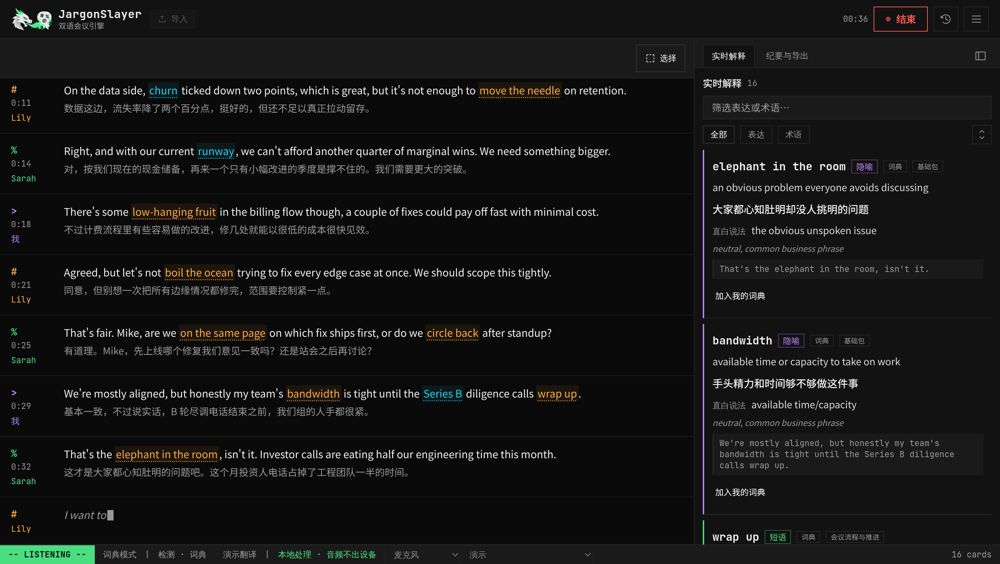

<picture>
  <source media="(prefers-color-scheme: dark)" srcset="apps/web/public/icon-ui-dark.png" />
  
</picture>

# JargonSlayer

**Private, fully local bilingual meeting engine for your Mac.**

*私有、全本地的 Mac 双语会议引擎*

**English** · [简体中文](README.zh-CN.md) · [**Try It Live**](https://apps.bioinfospace.com/jargonslayer) · [**Website & Docs**](https://mianaz.github.io/jargonslayer/)

---

JargonSlayer captures both sides of an English meeting at once — system audio and microphone, echo-cancelled and auto-tagged 我/对方 (macOS 26+). Local Whisper, Apple's on-device speech recognition, and on-device translation form the default pipeline — fully local, nothing leaves your Mac; cloud engines are strictly opt-in. A live bilingual transcript scrolls as people talk, and when the meeting ends one click files the bilingual summary into Obsidian — or copies it Notion-ready. Jargon still gets a short Chinese card, now live assist rather than the headline.

> The product UI is Simplified Chinese — it is built for non-native English speakers (Chinese-speaking professionals and researchers first).

## Get it

- **macOS desktop app** (Apple Silicon, recommended) — download the DMG from [Releases](https://github.com/mianaz/jargonslayer/releases/latest). The first-run wizard installs local Whisper into the app's own directory (nothing downloads without consent; deleting the directory is a clean uninstall). **System/app audio** (macOS 14.4+) transcribes meetings running in native apps — Zoom, Teams, WeChat — directly, with no virtual audio device.
- **Web app** — [try the hosted preview](https://apps.bioinfospace.com/jargonslayer) (built-in demo AI key, rate-limited), or self-host: `npm install && npm run build && npm start` with Node 20+. Details in the [docs](https://mianaz.github.io/jargonslayer/docs/). Works in mobile browsers too.
- **iOS (beta)** — available via TestFlight on request ([get in touch](https://mianaz.github.io/jargonslayer/)); on-device system speech recognition and on-device system translation (Apple Translation, no key required), iOS 26+.
- **Chrome extension (JargonSlayer Lite)** — live captions and jargon cards in a side panel. Manual install (the supported path; no Web Store listing for now): download the zip from [Releases](https://github.com/mianaz/jargonslayer/releases), unzip, open `chrome://extensions`, enable Developer mode, click "Load unpacked", pick the unzipped folder. [Step-by-step guide](https://mianaz.github.io/jargonslayer/docs/#quickstart).

## Features

- **Dual capture** — system audio and microphone recorded together, echo-cancelled (AEC) so your mic doesn't also pick up what's playing from your speakers; no virtual audio device (desktop, macOS 26+).
- **Fully local by default** — local Whisper, Apple on-device recognition and on-device translation run on your machine; with them, zero bytes leave your Mac. Cloud engines (bring your own key) are opt-in and labeled in the UI.
- **Bilingual live transcript** — English audio, Chinese translation, side by side as people talk.
- **我/对方 speaker attribution** — dual capture tags your mic and the meeting audio as 我 (you) and 对方 (them) automatically; pyannote diarization (optional one-click install) breaks out individual speakers live or from an imported recording.
- **Export to your vault** — one click files a bilingual summary and full transcript translation into Obsidian, or copies it Notion-ready and opens Notion to paste; also Anki, Markdown, JSON, and webhooks.
- **Jargon cards (live assist)** — slang, idioms, metaphors, acronyms → short Chinese explanations as they're spoken; dictionary mode is default (1,000+ entries, fully local, no key needed), with an optional AI mode (Beta, bring your own key) one toggle apart.
- **Learning center** — personal glossary, flip-card review with spaced repetition, a word cloud, and known-word suppression, all in one place.
- **Imports** — audio/video files and URLs, transcribed locally in the browser or by the sidecar.
- **Bit** 🐉 — the pixel dragon perched on the status line. Click it. Click it three times fast.

## Privacy

Transparent by default, fully local when you choose. Local Whisper and system/app audio never leave your machine — the status line shows 「音频在本地处理」; every other engine and tier states exactly where audio and text go. The full data-path table lives on the [privacy page](https://mianaz.github.io/jargonslayer/privacy.html).

## Docs

Setup guides (API keys, speaker diarization, troubleshooting), the per-platform engine matrix, and the FAQ all live on the website: **[mianaz.github.io/jargonslayer](https://mianaz.github.io/jargonslayer/)** · [Docs (EN)](https://mianaz.github.io/jargonslayer/docs/) · [文档（中文）](https://mianaz.github.io/jargonslayer/docs/zh/)

## Contributing & forks

Issues, pull requests, forks, and modified versions are all welcome — the license exists to make that easy, not to guard the code. This is a best-effort side project, so reviews may be slow; forking ahead instead of waiting is a perfectly good answer. If you build on it, keep the copyright and license notices intact (the AGPL requires this), and a visible link back to this repository in whatever you publish is appreciated. Contributions you submit are accepted under the project's AGPL-3.0 license.

## License

[AGPL-3.0](LICENSE) © 2026 Miana Zeng. Free to use anywhere, including at work; if you modify it and redistribute or host it as a service, you must share your source under the same terms. Releases up to and including v0.3.0 were published under MIT and remain so.

This is a personal side project, maintained on a best-effort basis — no support, uptime, or fitness for any purpose is promised (see the license's warranty disclaimer).
