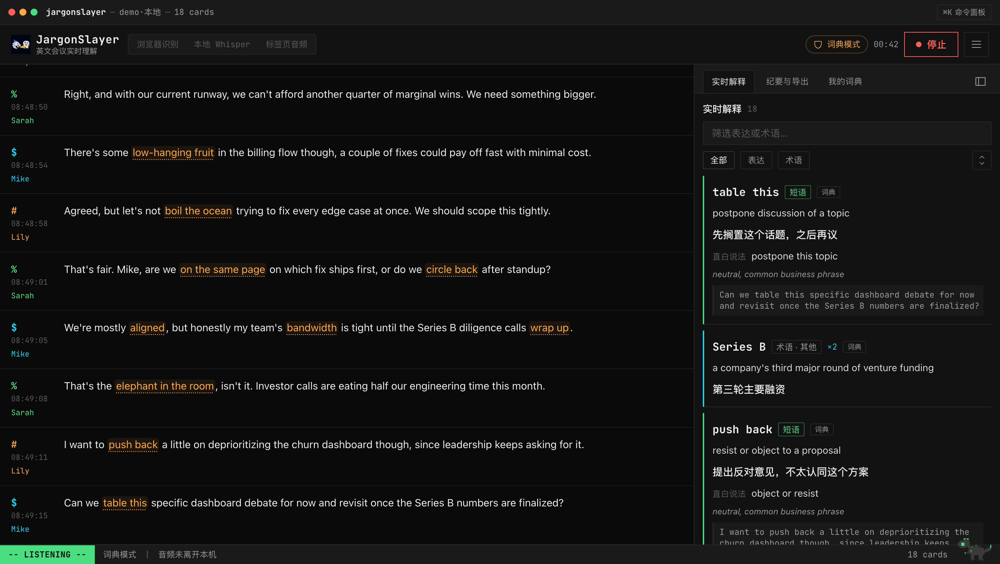
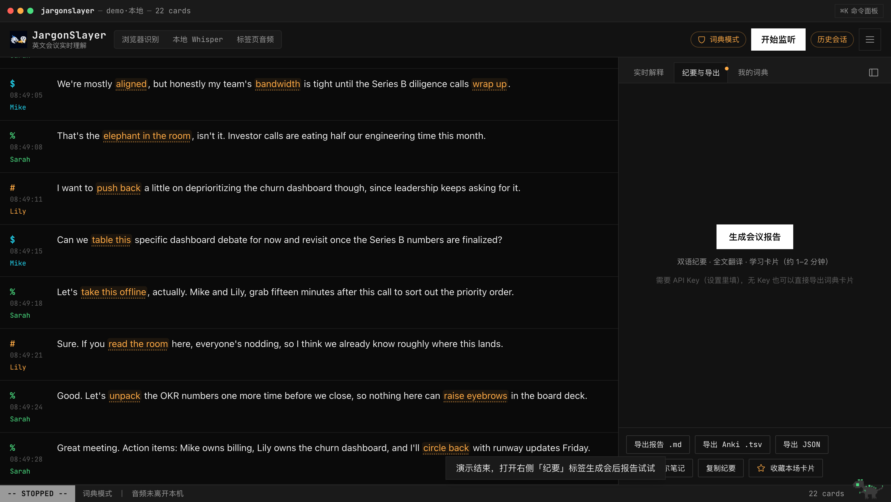
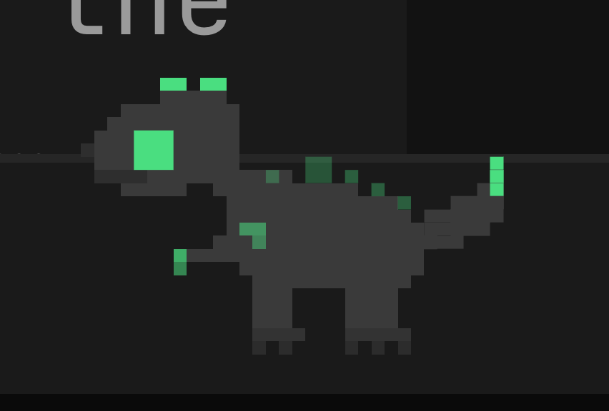

<div align="center">


# JargonSlayer

**英文会议实时理解助手 · 把会议变成一个正在运行的进程**

*Real-time English-meeting comprehension assistant · your meeting, as a running process*

[](https://github.com/mianaz/jargonslayer/releases)
[](LICENSE)
[](src/lib/__tests__)
[](#隐私边界明确说清楚)

[English](README.md) · **简体中文** · [**立即体验**](https://apps.bioinfospace.com/jargonslayer) · [网站](https://mianaz.github.io/jargonslayer/)



</div>

---

开英文会时它在旁边听，把**商务俚语、习语、隐喻、委婉说法、行业术语**实时变成简短的中文卡片；会议结束一键生成**双语纪要 + 全文翻译 + 学习卡片**。数据全部留在本机。

> 产品界面为简体中文，面向非英语母语者（中文职场人士与研究者优先）。文档双语提供：英文在 [README.md](README.md)，中文文档在 [docs/zh/](docs/zh/)。

## 为什么做这个

非母语者在会议里卡住，很少因为词汇量不够。真正卡住的是两件事：

1. **非字面表达** — *move the needle*、*boil the ocean*、*table this*。每个词都认识，整句就是不解析，等反应过来会议已经过去了。
2. **专有名词和缩写** — ARR、OKR、Series B、内部代号。母语者一秒略过，你要花那一秒去检索。

JargonSlayer 就是坐你旁边的同事：从不打断，只在侧边栏安静地告诉你那句话到底什么意思。

## 功能一览

- **实时转录** — 浏览器识别（云端）/ 本地 Whisper / 标签页音频（后两者音频不出本机），每个引擎带「本地 / 云端」数据去向标识；内置演示零依赖看完整流程。
- **实时表达检测** — LLM 结合前后语境判断，只解释"字面意思 ≠ 实际意思"的表达（能分清 *table this* 是"搁置议题"还是真的在说桌子）；专有名词/缩写单独成术语卡。没有 API Key 时自动用内置词典（370+ 条、10 个主题包可选，含商务/学术），还能从 GitHub 安装社区词典包。解释语言可切中文或英文。
- **双语转录**（可选）——在设置中开启后，会议进行时每句定稿的转录下方都会实时出现中文翻译，而不是等到会后报告才能看译文。
- **卡片体验** — 表达卡和术语卡统一卡牌样式，分类色条区分；重复出现只计数不刷屏；转录内带下划线的表达可点击跳到对应卡片；选中任意文字即席查询并可一键收进「我的词典」。
- **说话人** — 上传录音自动转录 + 说话人分离（后台进度，完成自动载入）；实时分离 beta（本地运行，标签随会议逐步修正）；说话人标签点击即可改名。
- **导入文稿**——已有文字记录？粘贴或上传 .txt / .srt / .vtt（Zoom、Otter 等导出），自动解析说话人和时间戳、生成术语卡片、可选逐句中文对照，存入历史可编辑。
- **导入音视频文件** — 上传 .wav/.mp3/.m4a/.flac 音频或 .mp4/.webm/.mov 视频（ffmpeg.wasm 自动提取音轨），Whisper 在 Web Worker 内本地转录（优先 WebGPU，退而 WASM），文件不离开浏览器；体验版开箱即用，转录结果接入与文稿导入相同的检测/翻译管线。
- **导入视频链接**（仅本地 sidecar）— 粘贴链接，sidecar 调 yt-dlp 下载后走与上传录音一致的转录管线；体验版刻意不提供此功能——服务端代抓第三方视频违反平台 TOS 且触碰 DMCA §1201（参考 *Cordova v. Huneault* 2026），只能在你自己的机器、你自己的账号下风险自负地跑。
- **会后产物** — 双语纪要（主题/要点/决定/行动项）、逐段对照翻译、学习卡片、**康奈尔笔记**（正文高亮 + 右栏批注，可导出 PNG 图片/Markdown）；另有 Markdown / Anki TSV / JSON 导出、自动落盘、webhook。
- **学习中心** — `/review` 页有统计、高频 Top 10、词云、翻卡练习；个人词典参与后续会议的检测。
- **BYOK / 多模型** — Anthropic 直连或任意 OpenAI 兼容端点（DeepSeek / Qwen / OpenRouter / Ollama）；也可一键 OAuth 连接 OpenRouter 账号（授权后自动生成 Key），或选 Poe 订阅预设。Key 只存本机浏览器。
- **免账号历史** — 全部存浏览器 IndexedDB，支持搜索曾出现过的表达；一键全量备份/恢复。

<div align="center">
<table>
  <tr>
    <td></td>
    <td></td>
  </tr>
  <tr>
    <td align="center"><sub>待机中的 REPL</sub></td>
    <td align="center"><sub>纪要与导出</sub></td>
  </tr>
</table>
</div>

## 快速开始

```bash
git clone https://github.com/mianaz/jargonslayer.git
cd jargonslayer
npm install
npm run dev
# 打开 http://localhost:3000
```

第一次打开会弹出新手引导。**先打开右上角 ≡ 菜单，点「演示」** — 不需要麦克风、不需要 API Key，就能看到完整的转录 → 检测 → 卡片 → 会后报告流程（无 Key 时演示走内置词典）。

## 配置 API Key（解锁 AI 检测与会后报告）

内置词典只能匹配固定短语。填入 Anthropic API Key 后才有上下文感知的 AI 检测（能分清 "table this" 是"搁置议题"还是真的把东西放桌上）和会后纪要/翻译。两种方式任选：

1. **UI 里填**（推荐）：≡ 菜单 → 「设置」 → AI 检测 → API Key。Key 只存在你本机浏览器里，随请求直发，不写入任何服务器。
2. **环境变量**：项目根目录建 `.env.local`：
   ```
   ANTHROPIC_API_KEY=sk-ant-...
   ```
   然后重启 `npm run dev`。

Key 从 [console.anthropic.com](https://console.anthropic.com/) 获取。默认模型：实时检测 `claude-haiku-4-5`（快、便宜），会后报告 `claude-sonnet-5`（质量），设置里都能换。

**成本参考**：60 分钟、约 9000 词的会议，实时检测约 $0.5，会后报告约 $0.3–0.55，合计约 **$1/场**；纯词典模式 $0。

## 转录引擎

| | 配置成本 | 音频去向 | 建议场景 |
|---|---|---|---|
| 浏览器识别 | 无 | 浏览器厂商语音服务（**云端**） | 日常、非敏感会议（Chrome/Edge） |
| 本地 Whisper | 装一次 Python 环境 | **不出本机** | 敏感内容、离线、想要更稳的识别 |
| 标签页音频 | 同上（走本地 sidecar） | **不出本机** | 线上会议转录对方声音（免虚拟声卡） |

「演示」不是引擎，而是一个菜单入口，回放预录会议，零配置看完整流程。

### 本地 Whisper（隐私模式）

```bash
cd sidecar
python3 -m venv .venv && source .venv/bin/activate
pip install -r requirements.txt
python whisper_server.py --model small
# 看到 "ws://127.0.0.1:8765 等待连接" 后，
# 回到网页：设置 → 转录引擎 → 本地 Whisper → 开始监听
```

| 模型 | 质量 | 速度 | 建议场景 |
|---|---|---|---|
| `tiny` / `base` | 一般 | 极快 | 低配机器试跑 |
| `small`（默认） | 好 | 实时无压力 | **日常推荐** |
| `medium` | 更好 | 接近实时 | 口音重、专业词多 |
| `large-v3` | 最好 | 偏慢 | 会后重转录 |

常用参数：`--language en`（默认）、`--partials`（说话过程中出灰色中间结果，更费 CPU）、`--save-audio meeting.wav`（保留录音，供会后说话人分离）。

### ⚠️ 转录"对方的声音"（线上会议必读）

麦克风只能听到**你自己**。Zoom/Teams/Meet 里对方的声音从扬声器出来，需要把系统音频变成一个输入设备：

- **macOS**：装 [BlackHole](https://github.com/ExistentialAudio/BlackHole)（免费虚拟声卡）→ 系统设置里建一个"多输出设备"（耳机 + BlackHole，你照常听声）→ JargonSlayer 设置里把麦克风选成 BlackHole，引擎用**本地 Whisper**（浏览器识别引擎不认虚拟设备选择，始终用系统默认输入）。
- **Windows**：VB-Cable 同理。
- 想同时转录你和对方：macOS「聚合设备」把麦克风 + BlackHole 合成一个输入。

## 使用流程

1. 选引擎 → 「开始监听」（浏览器会请求麦克风权限）。
2. 左侧看转录，右侧「实时解释」看卡片。带下划线的表达可点；选中一段文字会弹出即席解释。
3. 「停止」→ 自动存入历史 → 「纪要与导出」→ 「生成会议报告」。
4. 导出 Markdown / Anki TSV（可直接导入 Anki：文件 → 导入，字段以 Tab 分隔）/ JSON。
5. ≡ 菜单 → 「历史」可以重新打开任何一场会，支持按表达搜索（"那个 *boil the ocean* 是哪次会说的？"）。

## 说话人分离（可选）

两条路都已内置到 UI。一次性准备工作：

1. `pip install pyannote.audio`（装进 sidecar 的 `.venv`）；
2. HuggingFace 免费账号 → 依次接受三个模型的使用条款：[segmentation-3.0](https://huggingface.co/pyannote/segmentation-3.0)、[speaker-diarization-3.1](https://huggingface.co/pyannote/speaker-diarization-3.1)、[speaker-diarization-community-1](https://huggingface.co/pyannote/speaker-diarization-community-1)（pyannote 4.x 新增的依赖，漏掉会 403）；
3. 建一个 Read 权限的 token，填进 设置 → 说话人分离（或启动 sidecar 时传 `--hf-token`）。

**上传录音自动分离**：≡ 菜单 → 「历史」→ 「导入录音」，选音频文件（m4a/mp3/wav），后台转录 + 分离，完成后自动载入。点说话人标签即可改名（SPEAKER_1 → Elena）。

**实时分离（beta）**：设置 → 说话人分离 → 「实时说话人分离（beta）」。开会时标签延迟数秒出现并随会议进行逐步修正，会多占一些 CPU；转录本身不受影响。

> 注意：sidecar 的 `.venv` 内是绝对路径，移动或重命名项目目录后需要删掉重建（`rm -rf .venv && python3 -m venv .venv && pip install -r requirements.txt`）。

## 隐私边界（明确说清楚）

| 数据 | 去向 |
|---|---|
| 音频（本地 Whisper / 标签页音频） | 仅本机，websocket 走 127.0.0.1 |
| 音频（浏览器识别） | 浏览器厂商的语音服务 |
| 转录文本（AI 检测开启时） | Anthropic API（或你配置的 OpenAI 兼容端点）用于检测/纪要 |
| 转录文本（词典模式） | 仅本机 |
| 会议历史、设置、API Key | 仅本机浏览器（IndexedDB / localStorage） |

不想让任何文本出本机：设置里开「仅词典模式」。vim 风格状态栏始终显示当前音频去向（「音频未离开本机」/「音频经浏览器厂商云端识别」）。

## 认识 Bit 🐉



蹲在状态栏上的像素小龙叫 **Bit**：光标块瞳孔像光标一样眨眼，背鳍在监听时像信号格一样亮起，有新卡片落地时喷出 ANSI 彩色像素火焰。会议结束 30 秒后它会睡着。

它还能互动。试试点它。试试快速连点三次。试试按住不放。

<br clear="right" />

## 常见问题

- **「浏览器不支持语音识别」** — Safari/Firefox 对 Web Speech API 支持差，用 Chrome/Edge，或直接上本地 Whisper。
- **Whisper 连不上** — 确认 sidecar 终端还开着、地址是 `ws://localhost:8765`；防火墙放行本地端口。
- **卡片太少/太多** — 设置里调「置信度阈值」（低=多），或换检测模型。
- **会议在后台标签页时检测变慢** — 正常，浏览器会节流后台定时器；切回来会立即补检。已尽量用事件驱动缓解。
- **生成报告很慢** — 长会议的全文翻译是分块并行跑的，1–2 分钟正常；只想要卡片可以不生成报告直接导出。

## 技术栈与文档

Next.js 15 (App Router) + TypeScript + Tailwind + zustand + IndexedDB；LLM 调用走服务端路由代理（Anthropic Messages API 或 OpenAI 兼容端点，结构化输出 + 修复重试）；本地转录 faster-whisper sidecar（websocket + 能量 VAD）；说话人分离 pyannote 4.x。

| 文档 | 内容 | English |
|---|---|---|
| [ARCHITECTURE.md](docs/zh/ARCHITECTURE.md) | 分层、数据流、sidecar 协议 | [English](docs/ARCHITECTURE.md) |
| [PRODUCT.md](docs/zh/PRODUCT.md) | 定位、用户、产品决策 | [English](docs/PRODUCT.md) |
| [SCHEMA.md](docs/zh/SCHEMA.md) | Agent 原生输出契约（JSON/frontmatter） | [English](docs/SCHEMA.md) |
| [AGENT-WORKFLOWS.md](docs/zh/AGENT-WORKFLOWS.md) | 文件/webhook 输出、编排方案 | [English](docs/AGENT-WORKFLOWS.md) |
| [PACKAGING.md](docs/zh/PACKAGING.md) | 当前 PWA，Tauri 路线图 | [English](docs/PACKAGING.md) |
| [DESIGN.md](docs/zh/DESIGN.md) | 设计宪法（v3 终端主题、吉祥物规格） | [English](docs/DESIGN.md) |

设计历程：七套完整探索方案（水墨、魔典、8-bit、黑色电影、手绘、清绿、终端）保存在 [docs/design-explorations/](docs/design-explorations/)，终端方向作为默认皮肤上线，其余是未来皮肤路线图。

## 许可证

[MIT](LICENSE) © 2026 Miana Zeng
